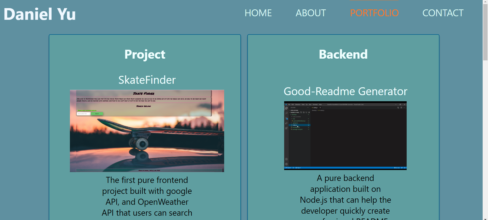
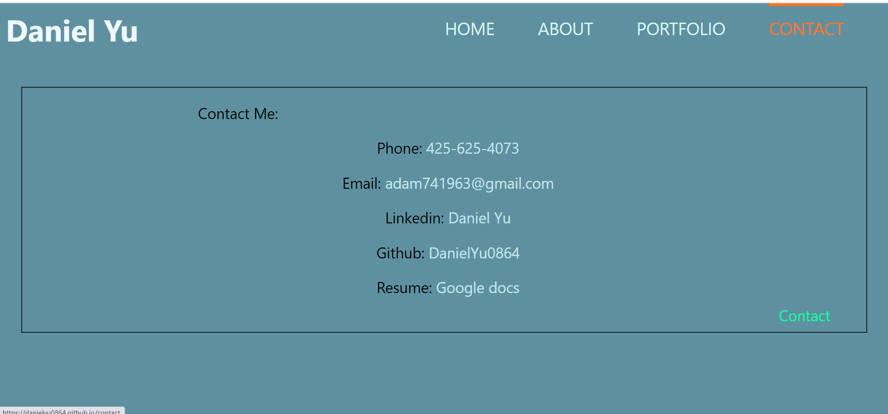
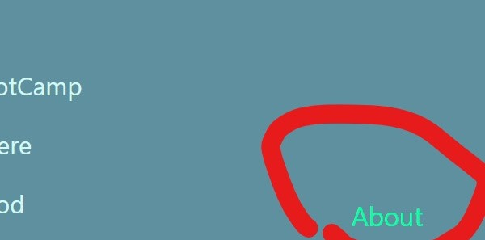

# Unit 20 React Homework: React Portfolio

### This portfolio is built on React

* Home

* About

* Portfolio

* Contact

* Header

* Footer

## About
* Project link: https://danielyu0864.github.io/DanielYu-HomeWork-20-React-Portfolio/
* Project Github: https://github.com/DanielYu0864/DanielYu-HomeWork-20-React-Portfolio
* Author: [`DanielYu0864`](https://github.com/DanielYu0864)

## Questions
*  For more question please contact me: adam741963@gmail.com

- - -
© 2020 - UW Coding Bootcamp Homework 20 React Portfolio User Directory by Daniel Yu
